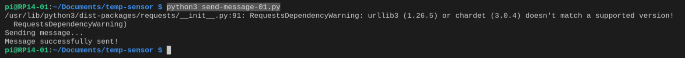
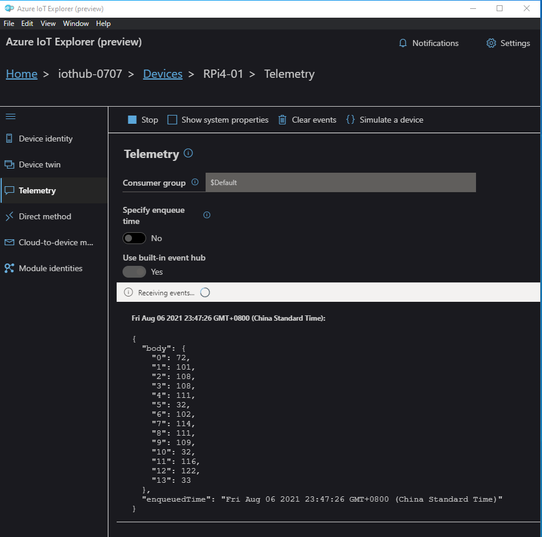

# Lab 1: Send a message to Azure IoT Hub - 01


The easiest way to send a message to Azure IoT Hub is to use Azure IoT Device Python SDK.

## Prerequisites
- Azure IoT Hub
  - Device Connection string: `HostName=iothub-0707.azure-devices.net;DeviceId=RPi4-01;SharedAccessKey=INh************************nxo=`
- Python 3.7+
- Azure IoT Explorer

## Step 1: Import libraries

In the first sample, you only need to import two libraries. 

One is `asyncio`, which is a library to write **concurrent** code using **asyncs/await** syntax.

The other is `azure.iot.device.aio` where you may import `IoTHubDeviceClient`.

The import code shall look like this:

```
import asyncio
from azure.iot.device.aio import IoTHubDeviceClient
```

## Step 2: Set the Device Connection String

```
# Set the connection string
cs = 'HostName=iothub-0707.azure-devices.net;DeviceId=RPi4-01;SharedAccessKey=INh********************************************nxo='
```

## Step 3: Create instance of the device client and connect

```
# Create instance of the device client using the connection string
client = IoTHubDeviceClient.create_from_connection_string(cs)

# Connect the device client
await client.connect()
```

## Step 4: Send a message

In this sample, we will send a simple message "Hello from tz!" to IoT Hub.

```
# Send a message
print("Sending message...")
await client.send_message("Hello from tz!")
print("Message successfully sent!")
```

## Step 5: Shut down the client

```
# Shut down the client
await client.shutdown()
```

The sample source code can be found [here](sources/send-messge-01.py).

## Run the app

On RPi4, run the app.

```
python3 ./python3 send-message-01.py
```



## View the message 

Use Azure IoT Explorer to view the messaeg received in IoT Hub.



As you may see, the message received in IoT Hub is displayed as ASCII code, where 72 is 'H', 101 is 'e', '108' is 'l', and so on. Therefore, the message received in the Azure IoT Hub is the correct one sent from RPi4.

You may find the ASCII code from below:

.

<END>


