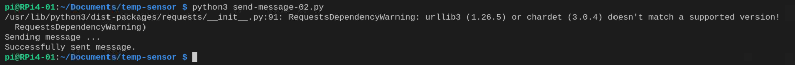
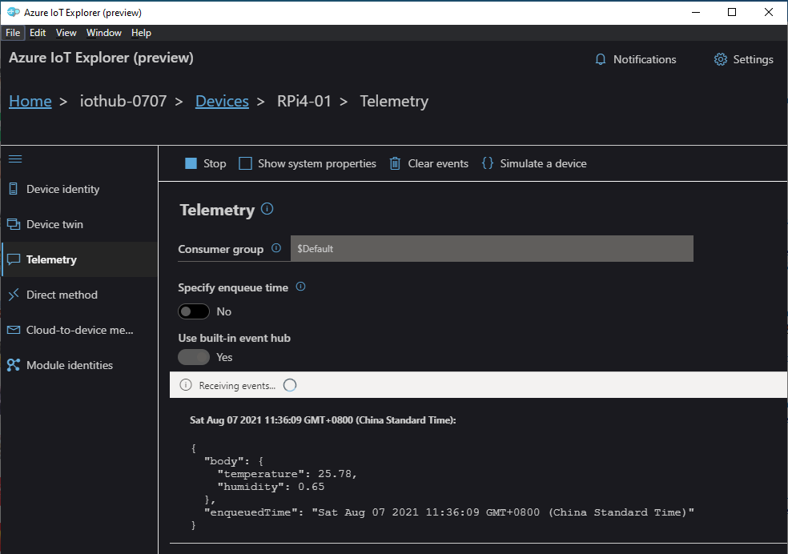

# Lab 2: Send telemetry to Azure IoT Hub

In Lab 1, we sent a simple message to Azure IoT Hub successfully. However, as you may have noticed, the message received in IoT Hub is not displayed in a very *friendly* format. 

In Lab 2, we will find a way to send the message in a more *friendly* format.

## Prerequisites
- Completed [Lab 1](Lab1-Send_message_to_iothub-01.md). Please do so if not yet.

## Step 1: Import libraries

### Use Message library

Firstly, we will use `Message` class from `azure.iot.device`.

You may find the details of `Message Class` from [here](https://docs.microsoft.com/en-us/python/api/azure-iot-device/azure.iot.device.message?view=azure-python).

The constructor is as below:

```
Message(data, message_id=None, content_encoding=None, content_type=None, output_name=None)
```

Some info you may want to know:
- `data` constructs the payload.
- `content_type` is the content type property used to route messages with the message-body, normally with value 'application/json'.

### Use JSON library

Telemetry normally comes with a meaning, like termperature=25.7, humidity=60%, etc. In this sample, we use Dictionary to store the telemetry. 

For instance, the telemetry can be defined as below:

```
telemetry = {
    "temperature": 25.78,
    "humidity": 0.65
    }
```

The message payload must be a string, bytearray, int, float or none, so you need to convert dict to Message. Here you may use `json.dumps()` method, thus JSON library need to be imported. 

Re JSON encoder and decoder, you may find more details and samples from [here](https://docs.python.org/3/library/json.html).


The import code shall look like this:

```
import asyncio
from azure.iot.device.aio import IoTHubDeviceClient

# use Message class
from azure.iot.device import Message

# use JSON lib
import json
```


## Step 2: Create telemetry for testing

```
# test telemetry for sending
telemetry = {
    "temperature": 25.78,
    "humidity": 0.65
    }
```

## Step 3: Send a message

In this sample, we send a simple telemetry with temperature and humidity to IoT Hub.
```
# define a send_test_message method
async def send_test_message():
    print("Sending message ... ")
    msg = Message(json.dumps(telemetry))
    await client.send_message(msg)
    print("Successfully sent message.")

# send message
await send_test_message()
```

## Step 4: Shut down the client

```
# Shut down the client
await client.shutdown()
```

The sample source code can be found [here](sources/send-messge-02.py).

## Run the app

On RPi4, run the app.

```
python3 ./python3 send-message-02.py
```



## View the message 

Use Azure IoT Explorer to view the messaeg received in IoT Hub.



Now, you see the payload is displayed in json format.

<END>


