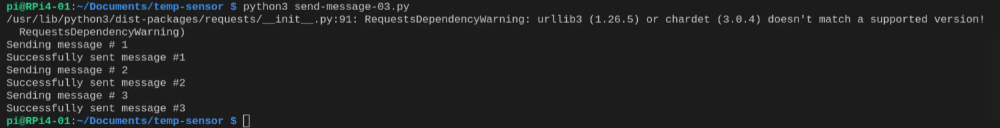

# Lab 3: Send simulated telemetry to Azure IoT Hub

In this lab, we will simulate some telemetry and send them to Azure IoT Hub. 

## Prerequisites
- Completed [Lab 1](Lab1-Send_message.md) and [Lab 2](Lab2-Send_telemetry.md). Please do so if not yet.

## Step 1: Import libraries

We will use random() method to generate some random values for the telemetry. Thus, random library is needed.

The import code shall look like this:

```
# use random
import random as rnd
```


## Step 2: Write a method to simulate telemetry

```
# Write a method to simulate telemetry
def simulate_telemetry():
    t = round(rnd.uniform(10.0, 35.0), 2)
    h = round(rnd.uniform(0.1, 0.8),2)

    telemetry = {
        "temperature": t,
        "humidity": h
        }

    return telemetry
```

## Step 3: Write a loop to send the telemetry


```
# Global varioable
times = 3

# define a send_test_message method
    async def send_test_message(n):
        for i in range(1, n + 1):
            print("Sending message # " + str(i))
            msg = Message(json.dumps(simulate_telemetry()))
            await client.send_message(msg)
            print("Successfully sent message #" + str(i))

    # send `specified times` messages in parallel
    await send_test_message(times)

```

## Step 4: Shut down the client

```
# Shut down the client
await client.shutdown()
```

The sample source code can be found [here](sources/send-messge-02.py).

## Run the app

On RPi4, run the app.

```
python3 ./python3 send-message-03.py
```



## View the message 

Use Azure IoT Explorer to view the messaeg received in IoT Hub.


Now, you see the payload is displayed in json format.

<END>


